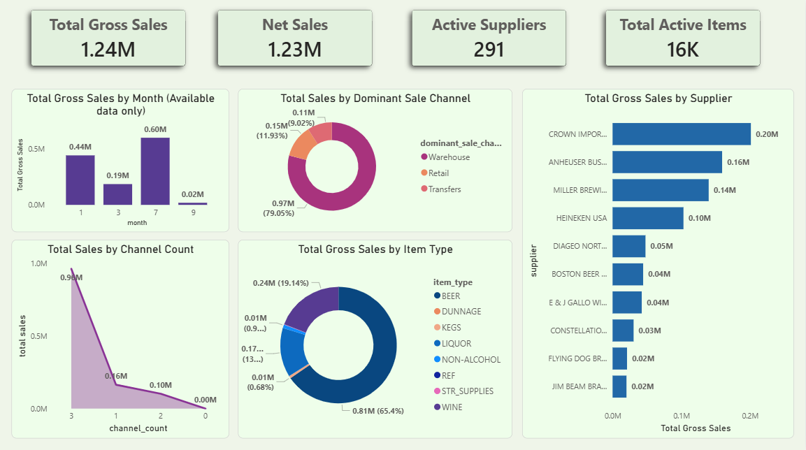

# Retail & Warehouse Sales Analysis

## Project Overview
This project analyzes retail and warehouse sales data to evaluate sales performance across channels, identify top-performing product categories and suppliers, and support data-driven business decisions. The analysis combines Python-based exploratory data analysis (EDA) with an interactive Power BI dashboard.

---

## Business Use Case
The insights from this project can help:
- Sales managers identify revenue-driving channels
- Inventory planners optimize stock and distribution
- Business analysts evaluate supplier and product concentration
- Teams understand the impact of zero and negative sales values (returns and adjustments)

---

## Dataset Summary
- Approximately 30,000 records
- Sales data from selected months in 2020
- Channels: Retail, Warehouse, Transfers
- Key fields include supplier, item type, sales metrics, and time attributes

---

## Analysis & Methodology
- Data quality assessment, including zero and negative sales analysis
- Data cleaning while preserving valid business scenarios
- Feature engineering (total sales, gross sales, adjustments, dominant channel)
- Exploratory data analysis using Python
- Interactive dashboard development using Power BI

---

## Power BI Dashboard Preview

### Dashboard Overview

> Detailed dashboard insights are documented in `powerbi/README.md`.

---

## Key Takeaways (Summary)
- Warehouse sales are the primary revenue driver.
- Beer is the dominant product category.
- Revenue is concentrated among a small number of suppliers.
- Most products rely on a single dominant sales channel.
- Time-based conclusions are limited due to partial-year data availability.

---

## Tools & Technologies
- Python (Pandas, NumPy, Matplotlib, Seaborn)
- Jupyter Notebook
- Power BI

---

## Repository Structure
retail-warehouse-sales-analysis/
├── notebooks/ # EDA notebook and documentation
├── powerbi/ # Power BI dashboard and insights
├── images/ # Dashboard screenshots
├── data/ # Raw and processed datasets
└── README.md # Project overview
